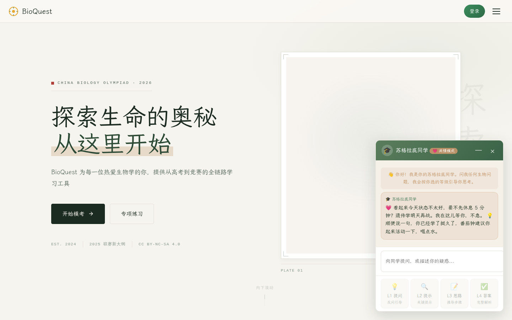

# BioQuest — 高中生生物学习平台

<div align="center">



**从联赛备考到高考模拟，一个网站搞定你的生物练习**

[🌐 在线 Demo](https://bio.sumalink.cn/) · [📝 开始刷题](https://bio.sumalink.cn/#/practice) · [💬 反馈问题](https://github.com/astrnox/BioQuest/issues)(现在没钱买服务器了，去看看GitHubpage吧...)

[]()
[](./LICENSE)
[]()
[]()
[]()

</div>

---

## 这是什么？

BioQuest 是一个专门给高中生做的生物学习网站。不管你是准备全国中学生生物联赛，还是想刷刷高考模拟题、巩固课本知识，都可以用它。
---

## 快速开始

### 👉 如果你只是想用（学生/老师）

直接打开在线版本就能用：**[https://bio.sumalink.cn/](https://bio.sumalink.cn/)**

- 不用注册也能刷题，注册了可以同步错题本和学习进度
- AI 导师、拍照搜题这些功能需要自己配一下 API Key（都是各家大模型的免费额度，不用花钱，里面有教程）
- 支持离线使用，添加到手机主屏幕当 App 用

### 👨‍💻 如果你想自己部署/改代码

这是个纯静态网站，不需要后端，部署起来很简单：

```bash
# 1. 克隆仓库
git clone https://github.com/astrnox/BioQuest.git
cd bioquest

# 2. 本地预览（选一个就行）
python -m http.server 8000   # Python
npx serve .                  # Node.js

# 3. 打开浏览器访问 http://localhost:8000
```

**部署到网上**：直接把整个文件夹丢到 GitHub Pages、Vercel、Netlify、Cloudflare Pages 任意一个免费托管平台就行，不需要构建，不需要服务器。

**需要配置的东西**：
- 数据库：去 [Supabase](https://supabase.com) 建个免费项目，跑一下 `sql/` 里的 SQL 文件，然后把地址和 key 填到 `js/supabase-client.js` 里（不配也行，会自动用浏览器本地存储）
- AI 功能：用户自己在「我的 → 设置」里填 API Key，开发者不用管

详细部署说明看 [DEPLOYMENT.md](./DEPLOYMENT.md)。

---

## 功能亮点

| 功能 | 能干嘛 |
|------|--------|
|  **刷题模考** | 联赛真题、高考模拟、分模块专项练习，做完自动判分出解析 |
|  **智能错题本** | 错题自动整理，还能拍照录题（支持印刷体和手写识别） |
|  **知识卡片** | Anki 风格的记忆卡片，根据遗忘曲线自动安排复习时间 |
|  **能力诊断** | 做完题有能力雷达图，告诉你哪块知识点弱 |
|  **AI 导师** | 有不会的随时问，支持画图、讲题、出类似题 |
|  **虚拟实验** | 质壁分离、色素分离、DNA 提取这些实验，在网页上就能模拟操作 |
|  **分子可视化** | 输入 SMILES 看 2D 结构，加载 PDB 看 3D 分子，还有基因组浏览器 |
|  **学习分析** | 看看自己每天学了多久，哪些题错得多 |
|  **社区讨论** | 和其他学生一起讨论题目 |

---

## 核心算法（技术向）

<details>
<summary><b>点击展开：那些让它变「聪明」的算法</b></summary>

### 1. 记忆复习算法（FSRS）
用 FSRS 代替了传统的 Anki SM-2 算法。简单说就是根据你记一张卡片的困难程度，自动算出下次什么时候复习效果最好，不用你自己安排。基于记忆的三个指标：稳定度、难度、可提取性来算的。

```js
const scheduler = tsFsrs.fsrs({ request_retention: 0.9, maximum_interval: 36500, enable_fuzz: true });
const result = scheduler.next(card, now, Rating.Good);
```

### 2. 能力估计（IRT）
不是简单的「做对多少题得多少分」，而是用项目反应理论（3PL 模型）从你做题的记录估计你的真实能力水平，哪道题难、哪道题区分度高都考虑进去。另外还有贝叶斯知识追踪（BKT）算你每个知识点大概掌握了多少概率。

### 3. OCR 拍照搜题
两层识别：如果用户配了多模态大模型的 Key，先用 AI 识别（准确率高，能识别斜体、公式）；否则用 Tesseract.js 在浏览器本地识别，先把图片放大、转灰度、调对比度、二值化，再识别，最后用几条正则修正常见识别错误。

```js
// 图像预处理
const stretched = gray.map(v => ((v - min) / (max - min)) * 255);
const bin = stretched.map(v => v > 140 ? 255 : 0);
```

### 4. 流式渲染
AI 回答的时候，为了不卡，先纯文本一个字一个字蹦出来（性能好），等回答完了再一次性渲染成 Markdown 格式，里面的 SVG 图也会自动画出来。

```js
chunkEl.textContent += delta;  // 流式：纯文本追加
finalEl.innerHTML = DOMPurify.sanitize(marked.parse(text));  // 完成后渲染
```


</details>

---

## 技术栈

纯前端架构，不需要跑后端服务器：

- **前端**：原生 JavaScript（单页应用）+ CSS3 + PWA（可以离线用）
- **数据**：Supabase（免费版）+ IndexedDB（浏览器本地数据库）
- **AI**：前端直接连 6 家大模型（DeepSeek、智谱、通义、Kimi、NVIDIA、硅基流动），流式输出
- **可视化**：Chart.js、Cytoscape.js（知识图谱）、Mermaid（画图）、3Dmol.js（3D分子）、igv.js（基因组）
- **OCR**：Tesseract.js（本地识别）+ 多模态大模型（云端识别）
- **字体**：霞鹜文楷（本地加载，不用等网络）

---

## 开源依赖

本项目打包了 24 个开源第三方库，都是 MIT/Apache/BSD 这类宽松协议，和 CC BY-NC-SA 兼容，完整许可证声明见 [`js/vendor/THIRD_PARTY_LICENSES.txt`](./js/vendor/THIRD_PARTY_LICENSES.txt)。

几个主要的：
- [ts-fsrs](https://github.com/open-spaced-repetition/ts-fsrs) — 间隔重复算法（MIT）
- [KaTeX](https://katex.org/) — 数学公式渲染（MIT）
- [Dexie.js](https://dexie.org/) — 浏览器本地数据库（Apache-2.0）
- [Chart.js](https://www.chartjs.org/) — 图表（MIT）
- [3Dmol.js](https://3dmol.org/) — 3D 分子可视化（BSD-3）
- [RDKit.js](https://www.rdkitjs.com/) — SMILES 转 2D 分子（BSD-3）
- [DOMPurify](https://github.com/cure53/DOMPurify) — XSS 防护（MPL-2.0/Apache-2.0）
- [Excalidraw](https://excalidraw.com/) — 手绘画板（MIT）
- [PhET](https://phet.colorado.edu) — 互动模拟实验（CC BY 4.0）
- [LXGW WenKai](https://github.com/lxgw/LxgwWenKai) — 中文字体（OFL-1.1）

---

## 许可证

本项目采用 [CC BY-NC-SA 4.0](./LICENSE)。

### 关于「非商业使用」的说明

简单说：**只要你不是卖这个软件本身，用于教育目的都可以**：

✅ 学生自己学习用、改着玩都没问题  
✅ 学校、辅导班老师用来教学（哪怕收学费也没关系，你是在卖教学服务，不是卖这个软件）  
✅ 公益教育项目、教育扶贫都可以用  
✅ 自己搭了给同学/学校内部用没问题  
❌ 把 BioQuest 包装成付费 SaaS 卖钱不行  
❌ 改了不闭源、去掉版权说自己写的不行

如果你真的有商业用途（比如企业培训），可以联系作者，教育相关的一般都免费给授权。

---

## Roadmap

未来打算做的事：

- [ ] 更多高考真题和模拟题（现在联赛题比较多，高考题会陆续加）
- [ ] 更好的错题本导出功能（可以打印、导出 PDF）
- [ ] 多端同步优化
- [ ] 生物画图题自动判分
- [ ] 更多虚拟实验
- [ ] 更多动画
- [ ] 班级/教师管理功能完善
- [ ] 移动端 App 打包（TWA/PWA 已经支持，后续考虑原生壳）

有什么想要的功能欢迎提 Issue！

---

## 贡献指南

欢迎贡献！不管你是：
- 会学生物的：来补题库、改题目错误、写解析
- 会写代码的：来修 Bug、加新功能
- 会设计的：来优化界面
- 什么都不会也没关系：用了有问题、有想法，提 Issue 就行

### 怎么贡献代码

1. Fork 本仓库
2. 新建你的功能分支（`git checkout -b feature/xxx`）
3. 提交你的改动（`git commit -m '加了个什么功能'`）
4. 推到你的分支（`git push origin feature/xxx`）
5. 开个 Pull Request

题库数据在 `data/` 文件夹里，加题直接改 JSON 就行。

---

## 致谢

- 感谢 **Congqianguo** 的贡献和支持
- 感谢 Open Spaced Repetition 社区的 FSRS 算法
- 感谢所有开源库的作者们
- 感谢 [PhET Interactive Simulations](https://phet.colorado.edu)（科罗拉多大学博尔德分校）提供的优质互动模拟
- 感谢每一个用 BioQuest 学生物的你，祝大家都能考出好成绩 🎓

---
对了，我是高中牲，可能反馈issue要用好久（比较忙）
<div align="center">
用 BioQuest，学生物不迷路 🌱
</div>
